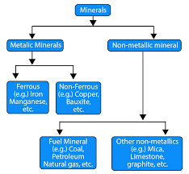

# The objective of the experiment
**Identification:** The students will get hands-on experience of identifying metallic and non-metallic minerals ores in hand specimens megascopically. This will help them in FIELD to  identify the important rock forming minerals. And Recognize the minerals of rocks.
**Observation:** Observation of the mineral to identify the mineral type and its different type of properties.

# Pre-requisite (if anything required)
- Basic knowledge of Minerals
- Specimens Availability
- Unglazed porcelain plate (known as a streak plate), hardness scale etc.

A mineral is **a naturally occurring inorganic solid, with a definite chemical composition, and an ordered atomic arrangement.** This may seem a bit of a mouthful, but if you break it down it becomes simpler. Minerals are naturally occurring. They are not made by humans. Minerals are inorganic.

Minerals are classified based on their crystal form and chemistry. Minerals are divided into two types namely **metallic and non-metallic.**
**More than 4,000**  naturally occurring minerals-inorganic solids that have a characteristic chemical composition and specific crystal structure-have been found on Earth
The five most common mineral groups in rock are the **silicates, carbonates, sulfates, halides, and oxides.** There are about 4000 known minerals in the Earth's crust, and about 92 % of them are silicates. The most abundant silicate is called plagioclase.

The broadest divisions of the **classification** used in the present discussion are 
-  native elements
-  sulfides
-  sulfosalts
-  oxides and hydroxides
-  halides
-  carbonates
-  nitrates
-  borates
-  sulfates
-  phosphates
-  silicates

 
Minerals are divided into groups based on chemical composition. Most minerals fit into one of **eight** mineral groups.

**The major classes of minerals are:**

-	silicates.
-	sulfides.
-	carbonates.
-	oxides.
-	halides.
-	sulfates.
-	phosphates.
-	native elements.

**Types of minerals:**
-	Native elements. eg. Gold, Silver, Mercury, graphite, diamond.
-	Oxides. eg corundum (incl.sapphire), hematite, spinel.
-	Hydroxides. eg. Goethite, brucite.
-	Sulfides. eg. Pyrite, galena, sphalerite.
-	Sulfates. eg. Baryte, gypsum.
-	Carbonates. eg. Calcite, magnesite, dolomite.
-	Phosphates.
-	Halides.

Minerals can be identified by their **color, luster, streak, cleavage, hardness, and even by their chemical composition.** Using these properties is one way a Geologist defines and identifies what kind of mineral a specimen is. 
Most minerals can be characterized and classified by their unique physical properties: **hardness, luster, color, streak, specific gravity, cleavage, fracture, and tenacity.**

### Study of Physical properties and identification of minerals.

**Rock forming Minerals:** Quartz, Feldspar, Muscovite, Biotite, Augite, Hornblende, Olivine, Garnet, Kyanite, Talc, Chlorite, Flit, Jasper, Asbestos, Calcite etc. Economic Minerals: Bauxite, Magnetite, Hematite, Pyrite and Chromite. Galena, Graphite, Pyrolusite, Magnesite 

### Identification based on the various physical properties of minerals are as follows 
1. Form 
2. Colour 
3. Streak 
4. Luster 
5. Fracture 
6. Cleavage 
7. Hardness 
8. Specific Gravity (Density) 
9. Degree of Transparency 
10. Special Properties.

**FORM:**
This is one of the first observation made when a mineral is examined in a hand specimen. The form represent the common mode of occurrence of a mineral in nature it is also called habit or structure of the mineral.
The following is the list of some common forms and the minerals which characteristically exhibit them, i.e., appearance of the particular form is indicative of a certain mineral.
| Sr No |	Name of the Form |	Description	| Mineral Example |
|----   |----                |----           |      ---       |
| 1    |	Lamellar Form   |	Mineral	appear separate layers	as	thin	| Different Mica varieties of |
| 2 |Tabular Form |	Mineral appear as slabs of  uniform thickness |	Feldspar |
| 3 |	Fibrous Form |	Mineral appear to be made up of fine threads fibers may or may not be separable |	Parallel Fibers     Asbestos type Satinspar. Radiating Fibers |Stibnite, Pyrite Zeolites |
| 4 |	Pisolitic Form | 	Mineral appear to be made up of small spherical grains(pea-size)	
| 5 |	Oolitic Form |	Similar	to	Pisolitie	but grains are  of still smaller size (like fish egg) | Some Limestone's |
| 6 |	Rhombic Form |	Rhombic Shape |	Calcite, Dolomite |
| 7 |	Bladed Form |	Mineral appear as cluster or as independent lath shaped (i.e. rectangular grains) |	Kyanite |
| 8 |	Granular Form |	Mineral appear to be made up of innumerable equidimensional grains of coarse or medium or fine size |	Chromite,Magnetite,Pyrite  |
| 9 |	Reni From |	Kidney shaped mineral appear with number of over lapping smooth and somewhat large curved surfaces |	Hematite |
| 10 |	Botryoidal Form | 	Similar to Reni form but with smaller curved faces like bunch of grapes | Chalcedony Psilomclane hematite |
| 11 |	Mammillary | Mineral appear with large mutually	interfering spheroidal surface - similar to Reni form |	Malachite |
| 12 |	Acicular Form |	Mineral appear to be made up of thin needles  | Natrolitc, Actinolite |
| 13 |	Columnar Form | 	Mineral	appear slender prism	as	long |	Tourmaline Topaz |
| 14 |	Prismatic Form |	As	elongated	indepent crystals |	Staucdite, Apatite, Quartz	Beryl, |
| 15 |	Spongy Form |	Porous |	Pyrolusite, Bauxite |
| 16 |	Crystal Form |	Polyhedral,	Geometrical Shapes |	Garnet, some Zeolites, Quartz,	Amethyst, Pyrite, Galena |
| 17 |	Interpenetrating Twin Form |	 |	Starurolitc | 
| 18 |	Massive Form |	No	definite	shape	for mineral	 | Fluorite, Pyrite Calcite, Graphite,Olivine Quartz, Jasper |
| 19 |	Concretionary Form | Porous and appear due to accretion	of	small irregularly shaped masses	 | Laterite |
| 20 |	Nodular Form  |	Irregularly shaped impact bodies with curved surface |	Flit, Limestone |

**COLOUR:**
It depends upon the absorption of some and the reflection of others of coloured ray of white light. Colour of an object depends upon the colour of the reflected rays when all other colour rays are observed the colour of a mineral is often its most striking property.
1.	Absorbed light represents energy that has been used to move electrons from energy level to the other.
2.	Factors affecting colour of a mineral type of element valence, state, type of bonding type of neighboring atoms, feature of local symmetry.

**For Example:**

##### Chemical composition of olivine of 2-end members
1.	**Fosterite:**  Mg~2~ SiO~4~ White Colour
2.	**Fayalite:**  Fl~2~ SiO~4~ Dark Bottle Green
This is caused by eh Fe~2~ ion observing the more of the reddish and the violet parts of the spectrum. Therefore, olivine is more or less green according to its iron content. Sometimes impurities cause colour.

##### Diagnostic colours of some minerals:

1.	Galena - Dark Leady Grey
2.	Hematite - Dark Leady Grey
3.	Graphite - Shining Black
4.	Pyrite - Black
5.	Olivine - Yellow
6.	Muscovite in book form - Silver White Colour
7.	Muscovite in thin layers - Colorless
8.	Magnesite - Spotless White
9.	Opal – Milky white
10.	Chromite, Magnetite - Black
Commonly Exhibited Colour of some Minerals

| Minerals->Colour  | Minerals->Colour	|
| --- | --- |
| Hornblende -> Dark Green |	Calcite -> White |
| Augite -> Greenish Black |	Quartz -> White / Colorless |
| Orthoclase -> White or Shades of Red |	Asbestos -> White, Green, Grey, Yellow |
| Plagioclase -> Grey or White |	Jasper -> Red|
| Microcline -> White, Pink or Green |	Flint -> Yellowish Brown|
| Kyanite -> Blue |	Limonite -> Yellow or Brownish|
| Garnet-> Red |	Baryets -> White / Pale Grey|
| Talc -> White / Pale  | Yellow ->	Gypsum -> Colorless or White|

### Minerals which show different colours:
1.	**Quartz** -> Colourless, White, Green, Violet, Grey, Yellow, Pink etc.,
2.	**Feldspar** -> White, Grey, Shades of Red, Green, Dirty, White etc.,
3.	**Calcite** -> Colourless, White, Shades of Red Grey, Yellow etc.,

**STREAK:**
The colour of mineral powder is called streak of a mineral, and may be quite different from that of the mineral mass. An unglazed white porcelain plate called a streak plate is used in the lab for testing the streak of a mineral. It is conveniently obtained for observation purpose by rubbing a mineral against by harder surface.
1.	It is a reliable property than colour during specific investigation of sulphides and some oxides.
2.	Magnetite and chromite, though look alike (inform, colour and luster) can be distinguished from streak. Magnetite gives black streak, whereas chromite gives brown streak.

**LUSTRE:**
Lustre is the nature of shining on the surface of the mineral.

#### Based on the Quality of Shining Lustre are grouped as:
| Sr No |	Name of the Lustre |	Description of Lustre |	Mineral Examples |
|--|--|--|--|
| 1 | 	Metallic Lustre |	Metallic Lustre is the type of shinning that appears on the surface of a metal |	Galena,	Pyrite, Gold, Bernie |
| 2 |	Submetallic Lustre | Similar to Metallic Lustre but the amount of Shining is less |	Hematite, Chromite, Magnetite, Ilmenite, Psiolmelane |
| 3 |	Vitreous Lustre |	Shining like a Glass Sheet |	Quartz,	Calcite, Dolomite, Feldspar		barytes etc. |
| 4 |	Sub vitreous | 	Sub vitreous Lustre is similar to vitreous but with less shining |	Pyroxenes	and amphiboles |
| 5 |	Pearly Lustre |	Shining like a Pearl |	Tale, Selenite (Gypsum) Mica Muscovite |
| 6 |	Silkey Lustre | 	Shining like a Silk |	Fibrous Minerals kike asbestos and satinspar |
| 7 |	Resinous Lustre |	Shining like a Resin |	Opal	agate chalcedony |
| 8 |	Greasy Lustre |	Shining like a Grease  |Graphite, Serpentine |
| 9 |	Adamantine Lustre |	Shining like a Diamond |	Garnet,	Sphene, Zircon Diamond |
| 10 |	Earthy or Dull Lustre |	Shining like a Earth or Chalk |	Magnesite, Kaolin,	Chalk Bauxite |

The Lustre of mineral may be of different degrees of intensity, according to the amount of light reflected form their surfaces: Splendent, Shinning, Glistening Glimmering and Dull.

**FRACTURE:**
Fracture is the randomly broken surface a mineral. It is important to note the characters of the fracture displayed in the broken or chipped surfaces. Fracture with irregular surfaces are independent and different from smooth flat surfaces of cleavages.

**Fracture is described as:**
| Sr No |	Name of the Fracture |	Description of the Mineral |	Mineral Examples |
| --- | --- | --- | --|
|1 | Even Fracture | If the broken surface of a mineral is plain an smooth, it is called Even Fracture|Magnetite, Chalk|
| 2 | 	Uneven Fracture |	If the broken surface is rough or irregular it is called Uneven Fracture | Most of the Minerals |
| 3 |	Hackly Fracture	| If the broken surface is very irregular like the end of a broken stick |	Asbestos, Tremolite, Kyanite |
| 4	|Conchoidal Fracture| If the broken surface is smooth and curved it is called Conchoidal Fracture |	Opal, Volcanic Glass
| 5	| Sub-Conchoidal Fracture |	If the curved nature is less prominent it is called Sub-Conchoidal Fracture	 | Agate, Flint, Japer etc.|

Like streak it is also less useful in mineral identification because a majority of the minerals shows the same kind of Fracture.

**CLEAVAGE:**
The definite direction or plane along which mineral tends to break easily is called the cleavage that mineral. Cleavage pane represents he planes of weakness in the atomic structure of a mineral. Cleavage if present occurs as innumerable parallel planes along which the mineral is equally weak. Hence all such parallel planes of weakness are referred to as a se. depending on their atomic structure. Crystalline mineral will have one set of cleavage, two sets of cleavage ,three sets of cleavage, four sets of cleavage, and six sets of cleavage. The atomic structure of a mineral is definite. The cleavage, character of the mineral will also be definite. In any mineral the occurrence of cleavage can be detected easily by fitting or turning the specimen in different directions. Depending or the atomic structure development of cleavage character may differ in different minerals or in the same mineral.Depending on the degree of perfection cleavage may be described as perfect or eminent or Excellent, Good, Imperfect, Poor or Indistinct. 

**Changes Angles in** 
- Calcite
- Pyroxene and Amphibole:

| Sr No |	Cleavage Sets |  Mineral Example |
|--|--|--|
| 1 |	One Set	 | Mica, Chlorite. |
| 2	| Two Sets	|Feldspar,	Pyroxenes, Amphiboles |
| 3 |	Three  Sets |	Calcite, Dolomite Galena |
| 4 |	Four Sets	 | Fluorite |
| 5 |	Seven Sets	| Sphalerite |
| 6 | No Cleavage	 | Quartz, Divine, Garnet |

**HARDNESS:**
Hardness may be defined as the resistance offered by mineral to abrasion or scratching. Hardness may be tested by rubbing or scratching the specimen over a file or knife. The amount powder and the degree of noise produced is a test of the hardness of the mineral. When a softer mineral is scratched by a harder mineral, a definite scratch is observed on the softer mineral.

A standard set of 10 reference mineral is used to determine the hardness of a mineral. This is called Moh's Scale of hardness.
| reference | Scale | reference | Scale |
|--|--|--|--|
| Talc	| **1** | Feldspar	| **6** |
| Gypsum	|  **2** | Quartz	| **7** |
| Calcite	| **3** |  Topaz	| **8** |
 | Fluorite	| **4** | Corundum	|  **9** |
 Apatite	|  **5** | Diamond	|  **10** |

Hardness may be tested by means of Penknife **(H=6)** Window Glass **(H=5)** and Fingernail **(H=2.5)**.

**SPECIFIC GRAVITY OR DENSITY:**

**Measure of Minerals Density**
1.	Density = Mass per unit volume Grams / cm3.
2.	Density depends on the type of atoms composing the mineral and how densely they have packed by the crystal lattice.

**General Range of Density:**
1.	Density around 2.7 common for light coloured rock forming minerals such as Felds par.
2.	Density around 6 common pyrite and other are forming minerals.

**Note:**
Some important rock forming minerals such as pyroxenes and Amphiboles have densities around 3.3.

Specific Gravity is the ratio between its weight and the weight of an equal volume of water at 40&deg;C. Based on the Specific Gravity of Minerals, the Density of Minerals may be described as High, Medium and Low.

| Sr No. |	Density	Mineral | Example |
|--|--|--|
| 1 |	Low Density	|  GYPSUM (2.3) Graphite (2-2.3) Coal (1-1.8) |
| 2 |	Medium Density  **(Sp.Gravity 2.5-3.5)**  |	Quartz	(2.7),	Feldspar	(2.56-3.00), Pyroxene	(3.1-3.5),Amphiboles	(2.9-3.47), Mica (2.7-3.1) |
| 3 |	High Density  **(Sp.Gravity 2.5-3.5)** |	Magnesite	(5.18),	Hematite	(4.9-5.3),Galena	(7.5),	Hematite	(3.5-5.5)Pyrolusite (4.8), Chromite (4.5-4.8) tin stone (8.71) |

**DEGREE OF TRANSPARENCY:**

Depending upon the resistance offered by the mineral to the passage of light through them, they may be classified as transparent, translucent and opaque.
- **Transparent:**   Passage of light through the mineral.
- **Translucent:** Allows the passage of light but reflects back the light by mineral.
- **Opaque:** Does not allow and does not reflect back the light.

**SPECIAL PROPERTIES:**

Some minerals exhibit peculiar characters which enable them to be identified easily. In some cases they are the consequences of the physical properties of the mineral itself. They are as follows.
- Tale by virtue of its Soft Nature **(H-1)**  exhibits smooth touch or soapy feel.
- Graphite ->  its low hardness **(H-1 to 2)** and black color marks on paper and due to their softness and black colour soil the fingers.

**People (who provided help in developing the experiment as name, email, and Photo)**

